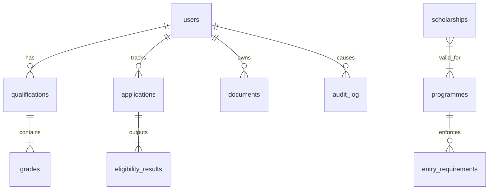
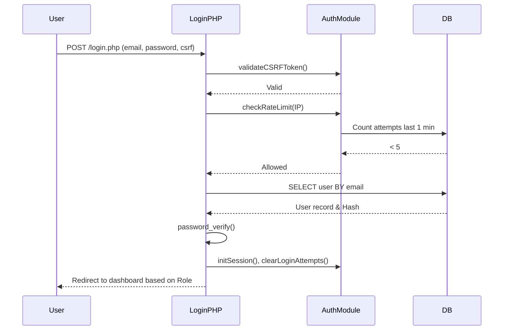
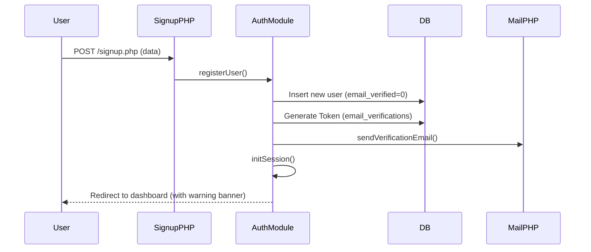

# UTP Scholarship System Architecture

## 1.1 System Overview
The UTP Scholarship & Course Eligibility System is a web-based portal designed to evaluate student academic qualifications (SPM, O-Level, IGCSE) against official Universiti Teknologi PETRONAS (UTP) entry requirements. The system calculates a fit percentage, provides gap analysis, and recommends matching scholarships. 

**Tech Stack:**
- **Language:** PHP 8.1+ (Vanilla, Object-Oriented/Procedural hybrid)
- **Database:** MySQL 8.0+
- **Frontend:** HTML5, CSS3 (Vanilla), Vanilla JS (No JS frameworks)
- **Architecture Pattern:** Multi-page Application (MPA)

**Entry Points:**
- `landing.html`: Public landing page marketing the portal.
- `login.php`: Authentication gateway.
- `signup.php`: Registration portal.
- `index.php`: Root redirector.

**Role Types:**
- `student`: Can upload documents, enter grades, check eligibility, view results, and update profile.
- `admin`: Can view system-wide statistics, review student applications, update application statuses, and view audit logs.

---

## 1.2 Full Database Schema

### users
| Column | Type | Constraints | Description |
|--------|------|-------------|-------------|
| id | INT | PK, AUTO_INCREMENT | Unique user identifier |
| full_name | VARCHAR(100) | NOT NULL | User's full name |
| email | VARCHAR(100) | NOT NULL, UNIQUE | User login email |
| password_hash | VARCHAR(255) | NOT NULL | Bcrypt hashed password |
| ic_number | VARCHAR(20) | NOT NULL, UNIQUE | Malaysian IC or Passport number |
| phone | VARCHAR(20) | NOT NULL | Contact number |
| role | ENUM | 'student', 'admin' | Role-based access control level |
| email_verified | TINYINT(1) | DEFAULT 0 | Whether email has been verified |
| created_at | TIMESTAMP | DEFAULT CURRENT_TIMESTAMP | Account creation time |

### qualifications
| Column | Type | Constraints | Description |
|--------|------|-------------|-------------|
| id | INT | PK, AUTO_INCREMENT | Unique qualification ID |
| user_id | INT | FK (users.id) | Owning user |
| qual_type | ENUM | 'SPM', 'O-Level', 'IGCSE' | Type of qualification |
| created_at | TIMESTAMP | DEFAULT CURRENT_TIMESTAMP | Submission time |

### grades
| Column | Type | Constraints | Description |
|--------|------|-------------|-------------|
| id | INT | PK, AUTO_INCREMENT | Unique grade entry ID |
| qualification_id | INT | FK (qualifications.id) | Parent qualification |
| subject | VARCHAR(100) | NOT NULL | Academic subject |
| grade | VARCHAR(10) | NOT NULL | Letter grade (e.g., A+, C) |

### programmes
| Column | Type | Constraints | Description |
|--------|------|-------------|-------------|
| id | INT | PK, AUTO_INCREMENT | Unique programme ID |
| name | VARCHAR(150) | NOT NULL | Programme name |
| category | VARCHAR(100) | NOT NULL | Faculty/Category grouping |
| description | TEXT | NULL | Marketing description |
| duration | VARCHAR(50) | NULL | Study duration |
| foundation_fee | DECIMAL(12,2)| DEFAULT 0 | Foundation phase cost |
| undergraduate_fee | DECIMAL(12,2)| DEFAULT 0 | Degree phase cost |
| is_active | TINYINT(1) | DEFAULT 1 | Soft delete flag |
| created_at | TIMESTAMP | DEFAULT CURRENT_TIMESTAMP | Record creation time |

### entry_requirements
| Column | Type | Constraints | Description |
|--------|------|-------------|-------------|
| id | INT | PK, AUTO_INCREMENT | Unique requirement ID |
| programme_id | INT | FK (programmes.id) | Target programme |
| qual_type | ENUM | 'SPM', 'O-Level', 'IGCSE' | Applicable qualification |
| subject | VARCHAR(100) | NOT NULL | Required subject name |
| min_grade | VARCHAR(10) | NOT NULL | Minimum passing letter grade |
| weight | DECIMAL(3,2) | DEFAULT 1.00| Weighting in AI calculation |

### scholarships
| Column | Type | Constraints | Description |
|--------|------|-------------|-------------|
| id | INT | PK, AUTO_INCREMENT | Unique scholarship ID |
| name | VARCHAR(200) | NOT NULL | Scholarship name |
| description | TEXT | NULL | Scholarship details |
| type | ENUM | 'scholarship', 'loan'...| Type of financial aid |
| budget_min | DECIMAL(12,2)| DEFAULT 0 | Minimum payout |
| budget_max | DECIMAL(12,2)| DEFAULT 0 | Maximum payout |
| min_fit_percentage| INT | DEFAULT 50 | Lowest AI score to match |
| start_date | DATE | NULL | Validity window start |
| end_date | DATE | NULL | Validity window end |
| is_active | TINYINT(1) | DEFAULT 1 | Soft delete flag |
| created_at | TIMESTAMP | DEFAULT CURRENT_TIMESTAMP | Record creation time |

### scholarship_programme
| Column | Type | Constraints | Description |
|--------|------|-------------|-------------|
| scholarship_id | INT | PK, FK (scholarships.id)| Link to scholarship |
| programme_id | INT | PK, FK (programmes.id) | Link to programme |

### applications
| Column | Type | Constraints | Description |
|--------|------|-------------|-------------|
| id | INT | PK, AUTO_INCREMENT | Unique app ID |
| user_id | INT | FK (users.id) | Applying student |
| qualification_id | INT | FK (qualifications.id) | Submitted grades |
| programme_id_1 | INT | FK (programmes.id) | 1st choice |
| programme_id_2 | INT | FK (programmes.id) | 2nd choice |
| programme_id_3 | INT | FK (programmes.id) | 3rd choice |
| scholarship_id | INT | FK (scholarships.id) | Selected scholarship |
| status | ENUM | 'submitted', etc. | Application workflow step |
| admin_notes | TEXT | NULL | Internal admin comments |
| reviewed_by | INT | FK (users.id) | Admin who reviewed |
| created_at | TIMESTAMP | DEFAULT CURRENT_TIMESTAMP | Submission time |
| updated_at | TIMESTAMP | ON UPDATE CURRENT_TIMESTAMP| Last modification time |

### eligibility_results
| Column | Type | Constraints | Description |
|--------|------|-------------|-------------|
| id | INT | PK, AUTO_INCREMENT | Unique result ID |
| application_id | INT | FK (applications.id) | Parent application |
| programme_id | INT | FK (programmes.id) | Evaluated programme |
| eligible | TINYINT(1) | DEFAULT 0 | Did they pass requirements? |
| fit_percentage| DECIMAL(5,2) | DEFAULT 0 | AI calculated fit score |
| recommendation_text| TEXT | NULL | Gap analysis output |

### login_attempts
| Column | Type | Constraints | Description |
|--------|------|-------------|-------------|
| id | INT | PK, AUTO_INCREMENT | Unique attempt ID |
| ip_address | VARCHAR(45) | NOT NULL | Source IP |
| attempted_at | TIMESTAMP | DEFAULT CURRENT_TIMESTAMP | Timestamp of failure |

### documents
| Column | Type | Constraints | Description |
|--------|------|-------------|-------------|
| id | INT | PK, AUTO_INCREMENT | Unique doc ID |
| user_id | INT | FK (users.id) | Owning user |
| doc_type | ENUM | 'ic', 'certificate', etc.| Category of document |
| filename | VARCHAR(255) | NOT NULL | Server-side secure name |
| original_name | VARCHAR(255) | NOT NULL | Client-side file name |
| file_size | INT | NOT NULL | Size in bytes |
| uploaded_at | TIMESTAMP | DEFAULT CURRENT_TIMESTAMP | Upload time |

### email_verifications & password_resets
| Column | Type | Constraints | Description |
|--------|------|-------------|-------------|
| id | INT | PK, AUTO_INCREMENT | Unique record ID |
| user_id | INT | FK (users.id) | Target user |
| token | VARCHAR(64) | NOT NULL, UNIQUE | Secure hex token |
| expires_at | DATETIME | NOT NULL | Expiration timestamp |
| created_at | TIMESTAMP | DEFAULT CURRENT_TIMESTAMP | Creation time |

### audit_log
| Column | Type | Constraints | Description |
|--------|------|-------------|-------------|
| id | INT | PK, AUTO_INCREMENT | Unique log ID |
| user_id | INT | FK (users.id) | Actor |
| action | VARCHAR(100) | NOT NULL | Event name |
| target_type | VARCHAR(50) | NULL | Entity affected |
| target_id | INT | NULL | ID of entity affected |
| details | TEXT | NULL | Granular context string |
| ip_address | VARCHAR(45) | NULL | Actor's IP address |
| created_at | TIMESTAMP | DEFAULT CURRENT_TIMESTAMP | Event time |

### fee_structure
| Column | Type | Constraints | Description |
|--------|------|-------------|-------------|
| id | INT | PK, AUTO_INCREMENT | Unique fee ID |
| fee_type | VARCHAR(100) | NOT NULL | Category of fee |
| description | VARCHAR(255) | NULL | Details |
| amount_min | DECIMAL(12,2)| NOT NULL | Minimum cost |
| amount_max | DECIMAL(12,2)| NULL | Maximum cost |
| frequency | VARCHAR(50) | DEFAULT 'one-time' | Payment recurrence |
| effective_date | DATE | NULL | Date effective |
| notes | TEXT | NULL | Internal/student notes |

---

## 1.3 Authentication & Session Flow

**Login Sequence**

**Registration Sequence**

**Session Hardening**
- Variables used: `user_id`, `role`, `full_name`, `email_verified`, `csrf_token`, `last_activity`
- Timeout: Enforced via `$_SESSION['last_activity']` check in `initSession()`. Expires after exactly 1800 seconds (30 minutes), triggering `session_unset()` and `session_destroy()`.

---

## 1.4 AI Eligibility Engine Logic

The `AIEngine::checkEligibility()` systematically scores academic profiles against university thresholds.

1. **Extraction:** Quals and attached subjects are loaded from DB.
2. **Scoring Map:**
   - SPM: A+(10), A(9), A-(8), B+(7), B(6), B-(5), C+(4), C(3), D(2), E(1), Fail(0).
   - O-Level/IGCSE: A*(10), A(9), B(7), C(5), D(3), E(2), Fail(0).
3. **Requirement Loop:** For each programme's required subjects, it checks the student's submission.
   - Exact Subject: Grades are converted to points.
   - "Other Subject" generics: Auto-matched with passing constants.
4. **Weighted Formula:**
   `maxWeightedScore += maxPoints(10) * subject_weight`
   `totalWeightedScore += studentPoints * subject_weight`
   `Fit Percentage = (totalWeightedScore / maxWeightedScore) * 100`
5. **Bonus Logic:** "Materials Engineering" applicants with ≥ 9 points in physics and chemistry receive an absolute +5% to their fit percentage.
6. **Confidence Labels:**
   - ≥ 90% = Excellent Match
   - ≥ 75% = Strong Match
   - ≥ 60% = Good Match
   - ≥ 40% = Possible Match
   - < 40%  = Not Recommended
7. **Gap Analysis:** Subjects scoring below standard or missing emit structured arrays populated into the UI.

---

## 1.5 Request Flow Map

| Method | Route | Resolution |
|--------|-------|------------|
| GET | `/landing.html` | Static marketing landing page |
| GET/POST | `/login.php` | Auth form → `loginUser()` → Session → Redirect |
| GET/POST | `/signup.php` | Reg form → `registerUser()` → Session → Redirect |
| GET/POST | `/forgot-password.php` | Request form → Token generation → Mail → Redirect |
| GET/POST | `/reset-password.php` | Token validation → New hash → DB update |
| GET | `/verify-email.php` | Token validation → `email_verified=1` |
| GET | `/resend-verification.php` | Rate-limited Mail trigger |
| GET | `/student/dashboard.php` | `requireStudent()` → Stats rendering |
| GET/POST | `/student/upload-documents.php` | `requireStudent()` → MIME checks → File write → DB update |
| GET/POST | `/student/check-eligibility.php` | `requireVerified()` → Grade inserts → `checkEligibility()` → Render |
| GET | `/student/results.php` | `requireStudent()` → Fetch `eligibility_results` → Match scholarships |
| GET/POST | `/student/my-profile.php` | `requireStudent()` → Fetch info → Hash compare → Update |
| GET/POST | `/admin/dashboard.php` | `requireAdmin()` → Global stats + Inline update mutations |
| GET/POST | `/admin/applications.php` | `requireAdmin()` → Filter/Search/Paginate → CSRF Review mutation |
| GET | `/admin/audit-log.php` | `requireAdmin()` → Paginate events view |
| POST | `/api/submit-application.php` | `requireVerified()` → CSRF check → DB Eligibility validation → App creation |
| GET | `/api/logout.php` | `logoutUser()` → `session_destroy()` → root redirect |

---

## 1.6 Security Controls Inventory

1. **CSRF Protection:**
   - Generated: `generateCSRFToken()` safely bounded to early session lifecycle. stored in `$_SESSION['csrf_token']`.
   - Validated: `validateCSRFToken()` on every destructive POST route logic check.
2. **Rate Limiting:**
   - `checkRateLimit($ip)` logs bad auth endpoints locally to `login_attempts`. Max 5 attempts rolling per 1-minute window.
3. **Input Sanitization:**
   - `sanitize($input)` trims whitespace only (recursively for arrays). Output escaping is handled separately at render time via the `e()` helper, which calls `htmlspecialchars($value, ENT_QUOTES, 'UTF-8')`.
4. **Password Hashing:**
   - Always deployed utilizing PHP's secure native `PASSWORD_BCRYPT` with cost heavily lifted to `12`.
5. **Session Hardening:**
   - Parameters locked natively in `initSession()`: `cookie_lifetime = 0`, `httponly = 1`, HTTPS `secure` condition switch, `samesite = Strict`, `use_strict_mode = 1`.
6. **Security Headers (`setSecurityHeaders()`):**
   - `X-Content-Type-Options: nosniff`
   - `X-Frame-Options: DENY`
   - `X-XSS-Protection: 1; mode=block`
   - `Referrer-Policy: strict-origin-when-cross-origin`
   - `Content-Security-Policy` limits all inline vectors and frames
   - `Permissions-Policy` disabled geo/cam/mic natively
7. **File Upload validation:**
   - Strictly enforces extensions via array filtering.
   - Enforces low-level `finfo_file` MIME type sniffing checking against `.php` and `.exe` spoofs. Size constraints capped securely at 2 Megabytes. Overwrites internal file names uniquely bound to `user_id` and timestamp sequences. 

---

## 1.7 Known Gaps & Risk Register

| ID | Component | Weakness Identified | Risk Level | Recommended Fix |
|----|-----------|--------------------|------------|-----------------|
| 1 | Modules | Monolithic inclusions. (`auth.php`, `security.php`, `ai_engine.php` cluster multiple unrelated logic classes) | LOW | Execute modularity refactor utilizing PSR-4 loading and single-responsibility classes. |
| 2 | Telemetry | Missing system-wide logging. Silent DB failures terminate the app ungracefully without alerts. | HIGH | Integrate Sentry SDK and emit errors uniformly into local logger contexts. |
| 3 | Testing | Absence of boundary regression tests and boundary verification frameworks. | HIGH | Embed PHPUnit test cases immediately executing CI sequences checking CSRF anomalies and Auth limits. |
| 4 | Deployment | Highly dependent on host machine local states (PHP versions, paths). | MEDIUM | Execute containerization standardizing the execution sequence via Docker and docker-compose configurations. |
