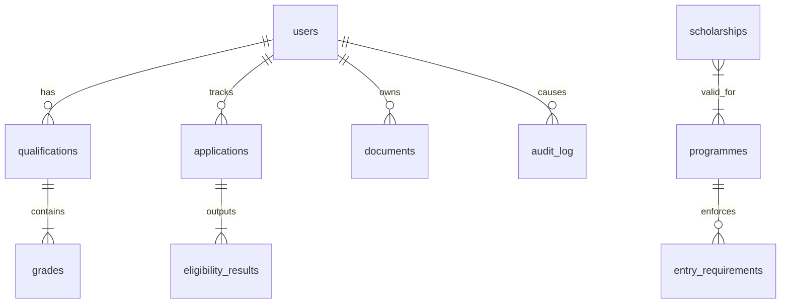

# UTP Scholarship System - Entity Relationship Diagram

This diagram visualizes the database table relationships mapping students to their qualifications, applications, and the AI evaluation engine outputs.

